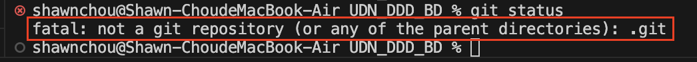
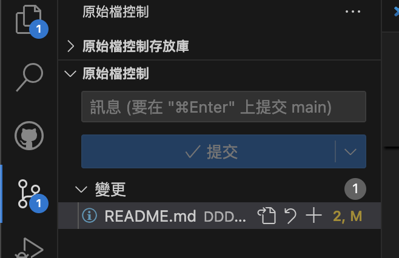

# UDN_DDD_BD
2024-08-24：預期以此Repo作爲BD中心技術文件知識庫，目前將建立「BD中心基礎資料」、「智慧策展」、「GCP_BQ」三類資料，將新人需要知道的知識與觀念對齊，除了增加技術知識外也預期增強協作效率，同步公司端以雲端備份
by Shawn

## 事前準備

從GitHub上取得知識庫的遠端Repo，在Windows或Mac上使用，若沒有特別使用習慣建議使用`VisualStudioCode(VScode)`搭配GitHub插件，以及閱讀[Git相關知識](#github與git的基本操作)。

除了檢視知識庫內的必要資訊外，也可在在經過討論後編輯更新知識庫的內容，一起擴充BD知識！

### 安裝VScode

`VScode`是截至2024年使用度都相當高的「編輯器」，可以在不同作業系統中使用，進入VScode官網下載安裝即可
[VScode](https://code.visualstudio.com/download "官網連結")

### 啟動GitHub套件和必要設定

## GitHub與Git的基本操作

基礎的GitHub與Git相關操作，已經有GitHub帳號者，請提供註冊GitHub的Email給[DDD_DB管理帳號](mailto:2020dddbd@gmail.com)或寄件至`2020dddbd@gmail.com`加入協作存取行列。

### 1. 註冊GitHub帳號

1. **前往GitHub官網**：打開瀏覽器並進入 [GitHub](https://github.com) 官網。
2. **註冊帳號**：點擊右上角的 **Sign up** 按鈕，按照指示輸入您的電子郵件地址、設定密碼，並選擇一個唯一的使用者名稱。
3. **設定個人資料**：完成註冊後，GitHub會引導您設定個人資料。

### 2. 安裝Git

1. **下載Git**：前往 [Git官網](https://git-scm.com) 下載對應您操作系統的安裝包。
2. **安裝Git**：按照安裝指引完成安裝。安裝完成後，可以透過終端機（Terminal）或命令提示字元（Command Prompt）輸入以下指令來確認Git是否已成功安裝：

   ```bash
   git --version
   ```

### 3. 設定Git

1. **設定全域使用者名稱和電子郵件**：安裝完成後，您需要設定Git的全域使用者名稱和電子郵件 *（記得是註冊GitHub的Email哦）* ，這將會附加在您的每次提交（commit）上。使用以下指令：

   ```bash
   git config --global user.name "Your Name"
   git config --global user.email "your_email@example.com"
   ```

2. **確認設定**：使用以下指令檢查設定是否正確：

   ```bash
   git config --list
   ```

### 4. 取得線上Repo到本地

1. **取得Repository的URL**：
   - 管理員或專案負責人會根據您提供的Email寄發GitHub邀請函，記得到信箱確認並同意加入專案repo，若未取得請寄件或詢問主管與同事們。

2. **將線上Repo複製到本地**：
   - 打開終端機，使用 `git clone` 指令將該repo複製到本地：

     ```bash
     git clone https://github.com/company/project-repo.git
     ```

   - 指令執行後，會在您的`當前目錄`下`建立一個新的目錄`，名稱與repository相同，這裡會包含該repo的所有內容。  
**這個資料夾的名稱可以在下載後修改成自己習慣的命名**

3. **進入該目錄**：
   - 使用 `cd` 指令進入新複製到本地的repository目錄：

     ```bash
     cd project-repo
     ```

4. **確認與線上同步狀態**：
   - 使用以下指令檢查您本地的repo是否與線上最新狀態同步：

     ```bash
     git status
     ```

   - 如果上方指令出現下方提示，記得檢查是否進入正確受到Git控制的資料夾中
   

   - 如果有更新或變更，統一使用`VScode`的`Git`插件，在確認要變更的資料中，按下「+」號後，在原始檔控制說明本次更新訊息後提交即可
   

